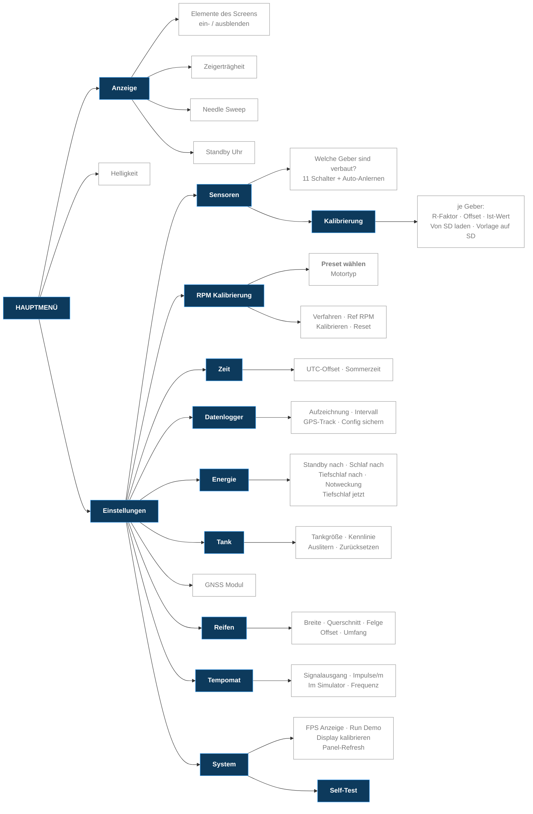

# Das Bedien-Menü

Übersicht über alle Menüpunkte der Firmware **v1.2.0 (Beta)**.

Bedient wird alles über den **Dreh-Encoder**.

---

## Bedienung

| Eingabe | Wirkung |
|---|---|
| **Drehen** | Zeile wechseln |
| **Kurz drücken** | Auswählen / Untermenü öffnen / Schalter umlegen |
| **Lang drücken** | Menü sofort komplett schließen |

Bei Punkten mit mehreren Werten (z. B. Helligkeit) drückst du **einmal** –
die Zeile wird **grün**. Jetzt änderst du mit dem Drehen den Wert. Noch einmal
drücken übernimmt ihn.

Passt eine Liste nicht komplett aufs Display, erscheint rechts eine
**Bildlaufleiste**. Einfach weiterdrehen, die Liste schiebt sich mit.

Die unterste Zeile ist immer **„Zurueck"**. Im Hauptmenü schließt sie das Menü.

---

## Der Menübaum

**Einstellungen** enthält bewusst nur Untermenüs. Alles, was ein Wert oder ein
Schalter ist, sitzt eine Ebene tiefer.

---

## Hauptmenü

| Punkt | Bedeutung |
|---|---|
| **Anzeige** | Was auf dem Display zu sehen ist |
| **Helligkeit** | 5 – 100 % (Stufen: 5, 10, 20, 30, 40, 60, 80, 100) |
| **Einstellungen** | Alles Weitere |
| **Zurueck** | Menü schließen |

---

## Anzeige

Hier blendest du einzelne Elemente des Screens ein und aus, auf dem du gerade
bist. **Die Liste ändert sich also je nach Screen.**

| Screen | Elemente, die du ein-/ausschalten kannst |
|---|---|
| **Screen 1** | Drehzahl Zeiger · Geschwindigkeit · Temp links · Temp rechts · Uhrzeit · Ladedruck |
| **Screen 3** | Drehzahl Zeiger · Drehzahl Bogen · Speed · Ladedruck · Ladeluft Temp · Tageskilometerzähler · Uhrzeit |

> **Screen 2 gibt es seit v1.2.0 nicht mehr.** Er war im Kern ein Screen 1 mit
> Tacho und Ladedruck – beides sitzt jetzt auf Screen 1. Der Zyklus geht also
> Screen 1 → Screen 3 → Debug.

> **Kühlwasser- und Tankzeiger stehen nicht mehr in der Liste.** Sie sind
> Pflichtanzeigen und werden immer angezeigt.

Darunter stehen – auf jedem Screen gleich – diese drei Punkte:

| Punkt | Bedeutung |
|---|---|
| **Zeigerträgheit** | Wie schnell die Zeiger einem Wert folgen: `Traege` · `Normal` · `Direkt` · `Snappy` |
| **Needle Sweep** | Der Begrüßungs-Zeigerlauf beim Einschalten |
| **Standby Uhr** | Springt sofort zum Uhren-Screen |

### Mehrfachwerte auf Screen 1

| Punkt | Auswahl |
|---|---|
| **Geschwindigkeit** | `Aus` · `Rad km/h` · `Rad km/h (b)` · `GPS km/h` · `Beide` |
| **Temp links** | `Aus` · `Luft` (Außentemperatur) · `Wasser` · `Beide` |
| **Temp rechts** | `Aus` · `Temp` (Öltemperatur) · `Druck` (Öldruck) · `Beide` |

`Rad km/h (b)` blendet zusätzlich die dunklen Segmente hinter den Ziffern ein,
wie bei einer echten Siebensegmentanzeige. Bei `Beide` steht groß das
Radsignal und klein darüber der GPS-Wert.

### Mehrfachwerte auf Screen 3

| Punkt | Auswahl |
|---|---|
| **Drehzahl Bogen** | `Aus` · `Zeiger` (wandert mit) · `Voll` (fest auf 100 %) |
| **Speed** | `Rad km/h` · `GPS km/h` · `Beide` · `Aus` |

---

## Einstellungen → Sensoren

Hier sagst du der Firmware, **welche Geber bei dir tatsächlich verbaut sind**.
Ein ausgeschalteter Geber wird nicht ausgewertet und erzeugt keine Warnung.

Tank · Kühlwasser · Ladedruck · Ansaug vor LLK · Ansaug nach LLK · Öldruck ·
Öldr.-Sch. 0,3 · Öldr.-Sch. 0,9 · Öltemperatur · Außentemperatur ·
Radsensor (Hall)

| Punkt | Bedeutung |
|---|---|
| **Oeldr.-Sch. ab** | Ab welcher Drehzahl der obere Öldruckschalter ausgewertet wird: `1500` · `1800` · `2000` · `2500`. VW verwendet je nach Modell 1500 oder 2000/min |
| **Auto-Anlernen** | Die Firmware prüft selbst, welche Geber angeschlossen sind, und setzt die Schalter passend |
| **Kalibrierung** | Untermenü, siehe unten |

> Diese Liste ist länger als das Display – hier scrollt das Menü.

### Sensoren → Kalibrierung

Gleicht die Streuung der Geber aus. NTC-Geber haben ±15 % Toleranz – beim
Kühlwasser sind das bei echten 80 °C rund **9 Grad** Unterschied von Geber zu
Geber.

Je Geber (Kühlwasser · Öltemperatur · Ansaug vor/nach LLK · Öldruck):

| Punkt | Bedeutung |
|---|---|
| **Quelle** | Woher die Kennlinie kommt: `Werk` · `NVS` (im Gerät gespeichert) · `SD` |
| **R-Faktor** | 0,80 – 1,25 – der eigentliche Abgleich |
| **Offset** | ±10 Grad (Öldruck ±0,5 bar) für den Restfehler |
| **Ist-Wert** | Der aktuelle Messwert, live |
| **Auf Werk zurück** | Kennlinie und Abgleich dieses Gebers verwerfen |

**So gleichst du ab:** Geber in kochendes Wasser, dann den `R-Faktor` drehen,
bis der `Ist-Wert` auf 100 °C steht. **Ein Messpunkt genügt** – der Faktor zieht
die Kennlinie über den ganzen Temperaturbereich richtig.

Darunter, für alle Geber zusammen:

| Punkt | Bedeutung |
|---|---|
| **Von SD laden** | Kennlinien aus `/sdcard/cfg/sensor_cal.ini` übernehmen |
| **Vorlage auf SD** | Die aktuell aktiven Kurven als Datei zurückschreiben |
| **Alle auf Werk** | Alles verwerfen |

> Fehlt die Datei auf der Karte, legt die Firmware beim Start selbst eine
> kommentierte Vorlage an. Punkt **und** Komma sind als Dezimaltrenner erlaubt,
> die Reihenfolge der Messpunkte ist egal.

---

## Einstellungen → Reifen

Damit der Tacho stimmt, muss die Firmware den Abrollumfang kennen.

| Punkt | Bedeutung |
|---|---|
| **Breite** | 155 – 305 mm |
| **Querschnitt** | 30 – 85 % |
| **Felge** | 13 – 20 Zoll |
| **Offset** | Feintrimm −10,0 … +10,0 % |
| **Umfang** | Nur Anzeige – rechnet beim Drehen live mit |

Kontrollwert: **225/55 R16 → 2054 mm**.

> Wird die Umfang-Zeile **rot**, passt die Kombination nicht zusammen und die
> Firmware rechnet ersatzweise mit dem Standardwert. Einfach zurückdrehen.

**Nach dem Einstellen einmal gegen GPS gegenprüfen** und die Abweichung über
`Offset` ausgleichen.

---

## Einstellungen → Tank

| Punkt | Bedeutung |
|---|---|
| **Tankgroesse** | Fassungsvermögen in Litern |
| **Kennlinie** | Kennlinie des Tankgebers |
| **Auslitern** | Assistent: Tank in Schritten leerfahren und die Werte aufnehmen |
| **Zuruecksetzen** | Kalibrierung verwerfen |

---

## Einstellungen → RPM Kalibrierung

Damit die Drehzahl stimmt, muss die Firmware wissen, wie viele Impulse dein
Motor pro Umdrehung liefert.

| Punkt | Bedeutung |
|---|---|
| **Preset wählen** | Motortyp vorgeben: `Diesel JX/AAZ`, `Benz 4-Zyl`, `Benz 5-Zyl`, `Benz 6-Zyl`, `Custom / ECU` oder `Manuell` (frei einstellbar) |
| **Verfahren** | Messverfahren der Drehzahl |
| **Ref RPM** | Referenz-Drehzahl fürs Kalibrieren (Leerlauf, z. B. 840) |
| **Kalibrieren** | Motor auf die Referenz-Drehzahl bringen, dann diesen Punkt drücken |
| **Reset** | Kalibrierung verwerfen |

---

## Einstellungen → Zeit

| Punkt | Bedeutung |
|---|---|
| **UTC-Offset** | Zeitzone (Deutschland Winter: `+1`) |
| **Sommerzeit** | Eine Stunde dazu |

Die Uhrzeit selbst kommt vom GPS.

---

## Einstellungen → Datenlogger

| Punkt | Bedeutung |
|---|---|
| **Aufzeichnung** | Messwerte auf die SD-Karte schreiben |
| **Intervall** | Wie oft aufgezeichnet wird (in 10-Sekunden-Schritten) |
| **GPS-Track** | Zusätzlich die gefahrene Strecke aufzeichnen |
| **Config sichern** | Schreibt **alle** Einstellungen des Geräts als lesbare Datei nach `/sdcard/cfg/vedo_config.ini`. Das Ergebnis steht direkt hinter dem Menüpunkt (`OK` / `KEINE SD` / `FEHLER`) |

---

## Einstellungen → Energie

| Punkt | Bedeutung |
|---|---|
| **Standby nach** | Nach dieser Zeit ohne Bedienung springt das Gerät auf die Standby-Uhr (30 s bis 30 min, oder `Aus`) |
| **Schlaf nach** | Nach dieser Zeit geht das Display aus (30 s bis 60 min, oder `Aus`) |
| **Tiefschlaf nach** | Nach dieser Zeit im Schlaf geht das Gerät ganz aus (1 min bis 12 h, oder `Aus`). Ab Werk **Aus** |
| **Notweckung** | Sicherheitstimer, der das Gerät aus dem Tiefschlaf zurückholt (`Aus` · 1 min · 5 min · 15 min · 1 h · 12 h). Ab Werk 1 min |
| **Tiefschlaf jetzt** | Sofort in den Tiefschlaf |

> Die Zeiten **addieren sich**: „Schlaf nach" zählt ab der letzten Bedienung,
> „Tiefschlaf nach" erst ab dem Einschlafen.

> ⚠️ Rot dargestellte Einträge sind die scharfen: `Tiefschlaf nach` alles außer
> `Aus`, und `Notweckung` auf `Aus`. **Beides zusammen** heißt, dass das Gerät
> nur noch über die Weckleitung zurückkommt.

---

## Einstellungen → GNSS Modul

Welches GPS-Modul verbaut ist: **LC76G** oder **SR1612U10** (u-blox M10).
Die Wahl wird gespeichert und beim nächsten Start automatisch verwendet.

---

## Einstellungen → Tempomat

Der Geschwindigkeits-Ausgang zum Steuergerät (VSS).

| Punkt | Bedeutung |
|---|---|
| **Signalausgang** | Hauptschalter. Aus = am Ausgang passiert nichts |
| **Impulse/m** | Kennwert des Steuergeräts: 1 · 2 · **4** · 6 · 8 · 16, zusätzlich als `/km` angezeigt |
| **Im Simulator** | Darf die Demo den Ausgang treiben? Aus = am Schreibtisch bleibt er still |
| **Frequenz** | Nur Anzeige: was **wirklich** am Ausgang anliegt. `---` = es geht nichts raus |

Die Frequenzzeile ist der gemessene Wert, nicht der gerechnete – damit lässt
sich der Ausgang ohne Messgerät prüfen.

Einen Feintrimm gibt es hier bewusst nicht: die einzige verbleibende
Fehlerquelle ist die Geschwindigkeitsberechnung, und die wird unter
**Reifen → Offset** getrimmt.

---

## Einstellungen → System

Werkzeuge für Diagnose und Service – im Alltag brauchst du die nicht.

| Punkt | Bedeutung |
|---|---|
| **FPS Anzeige** | Blendet die Bildrate auf den Cluster-Screens ein (grün ab 20, gelb ab 10, darunter rot) |
| **Run Demo** | Simulierte Fahrt, um die Anzeigen ohne laufenden Motor zu prüfen: `Aus` · `Stadt` · `Ueberland` · `Autobahn` · `Vollgas` |
| **Self-Test** | Siehe unten |
| **Display kalibrieren** | Bildlage des Displays einstellen |
| **Panel-Refresh** | Treibt **Nachleuchten** (Image Sticking) aus dem Display, wenn ein Standbild sich eingebrannt hat |

> Der Zyklus lässt sich im laufenden Betrieb wechseln. Temperaturen, Tankinhalt
> und Trip bleiben dabei stehen, es ändert sich nur das Fahrverhalten.
> `Vollgas` ist ausdrücklich keine realistische Fahrt, sondern eine Vorführung.

### System → Self-Test

| Punkt | Bedeutung |
|---|---|
| **Bei Start** | Selbsttest bei jedem Einschalten ausführen |
| **Manueller Start** | Selbsttest jetzt sofort ausführen |

---

## Wo finde ich die Version?

Im **Boot-Screen** und **unten im Menü** – dort steht immer die laufende
Firmware-Version.
